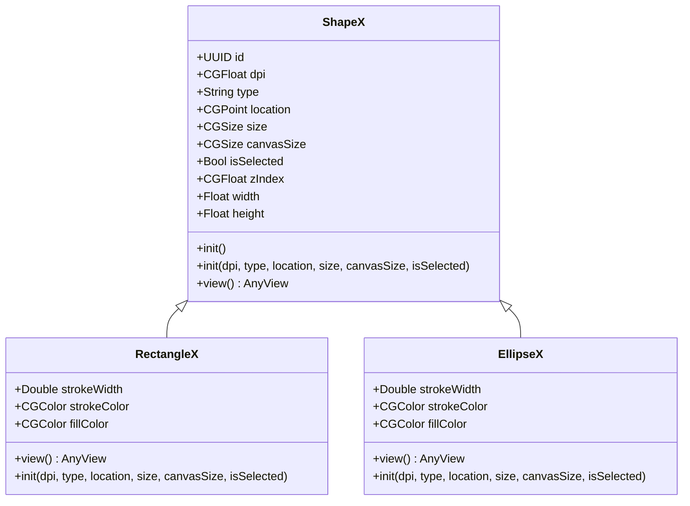

#  DiagramNew
An app to draw vector images

## Overview
Use the `Canvas` view as the document view.  Render Shapes within the `Canvas`

[Canvas](https://developer.apple.com/documentation/swiftui/canvas)


### Shapes
[Shape](https://developer.apple.com/documentation/swiftui/shape)

[Hacking With Swift](https://www.hackingwithswift.com/quick-start/swiftui/swiftuis-built-in-shapes)
[Paths vs. Shapes](https://www.hackingwithswift.com/books/ios-swiftui/paths-vs-shapes-in-swiftui)

A `Shape` wraps a series of steps to draw a `Path`

### Reference Project
[SwiftUI-WYSIWYG-Draw](https://github.com/Misfits-Rebels-Outcasts/SwiftUI-WYSIWYG-Draw)



Each subclass of `ShapeX` must override the `func view() -> AnyView`. The `view()` of `RectangleX` is implemented:

```swift
override func view() -> AnyView {
    AnyView(
        Rectangle()
            .stroke(strokeColor, lineWidth: strokeWidth)
            .background(Rectangle().fill(fillColor))
            //.fill(Color.white)
            .frame(width: self.size.width, height: self.size.height)
            //.border(Color.black)
            .position(self.location)
    )            
}
```

The `Rectangle` struct has the following definition:

```swift
@frozen public struct Rectangle : Shape {

    /// Describes this shape as a path within a rectangular frame of reference.
    ///
    /// - Parameter rect: The frame of reference for describing this shape.
    ///
    /// - Returns: A path that describes this shape.
    nonisolated public func path(in rect: CGRect) -> Path
```

# Binding (Sticky Connections)
Binding interactions in Excalidraw manage how elements like arrows or text labels **stick** to shapes and move/resize along with them. Here’s a deeper dive into how they work:

---

## 🔗 1. What Is Binding?

Bindings define positional relationships between two elements:

* **Arrow → Shape**: Connects arrow endpoints to a target shape, ensuring the arrow attaches to the nearest edge or anchor.
* **Text → Container or Line**: Keeps labels aligned inside a shape or centered on a line/arrow.
  These relationships ensure visual consistency during element transformations. ([deepwiki.com][1])

---

## 🧠 2. How Binding Data Is Stored

When an arrow or text is bound, its element object includes a `binding` field:

```ts
interface Binding {
  focus: { x: number; y: number };       // Relative binding point
  elementId: string;                      // ID of the target element
  focusElementId?: string;                // For multi-point bindings (lines/arrows)
}
```

This tells Excalidraw **which element** you’re bound to and **where** on it.

---

## 🎯 3. Binding during Creation

* **Drawing an arrow**:
  As you draw and hover near a shape, Excalidraw calculates the nearest edge point and captures that in `binding.focus`, associating your arrow with that shape's ID.

* **Placing text**:
  When you drop a text label inside another element or on a line, similar binding logic is applied to position it relative to the target.&#x20;

---

## 🎬 4. Transformations & Bound Elements

When the bound element moves, resizes, or rotates:

1. Excalidraw detects changes in the target.
2. It recomputes absolute coordinates from `binding.focus`.
3. The bound arrow endpoint or text label is repositioned accordingly.

This ensures the connector remains visually attached through transformations. ([deepwiki.com][2])

---

## ✂️ 5. Unbinding and Removal

* **Deleting a bound element**:
  Any element that references it in the `binding` field automatically loses its binding—so arrows drop free or text stays in place.

This mechanism keeps the scene consistent and avoids broken references. ([deepwiki.com][1])

---

## 🛠️ 6. Code Locations to Peek At

Explore the following key areas in the codebase:

* **Binding logic**: `packages/excalidraw/src/element-binder.ts`
* **Binding handling during input**: `app/src/scene/data.ts` and `bindings.ts`
* **Position recalculation & updates**: `updateBoundElements.ts` (called during move/transform)

These modules define how Excalidraw:

* Detects nearest binding targets
* Creates and stores binding metadata
* Recomputes positions during scene updates

---

### ✅ Summary

Bindings provide a robust way to maintain relational consistency between elements:

* **Stored metadata** (`binding.focus`, target ID) persists the relationship
* **Runtime updates** recalculate positions on transformations
* **Deletion handling** ensures clean removal of relationships

Let me know if you'd like to dive into specific functions like `applyBindings()` or coordinate transformation math!

[1]: https://deepwiki.com/zsviczian/excalidraw/3.4.2-element-bindings-and-relationships?utm_source=chatgpt.com "Element Bindings and Relationships | zsviczian/excalidraw | DeepWiki"
[2]: https://deepwiki.com/excalidraw/excalidraw/5.1-text-binding?utm_source=chatgpt.com "Text Binding | excalidraw/excalidraw | DeepWiki"


